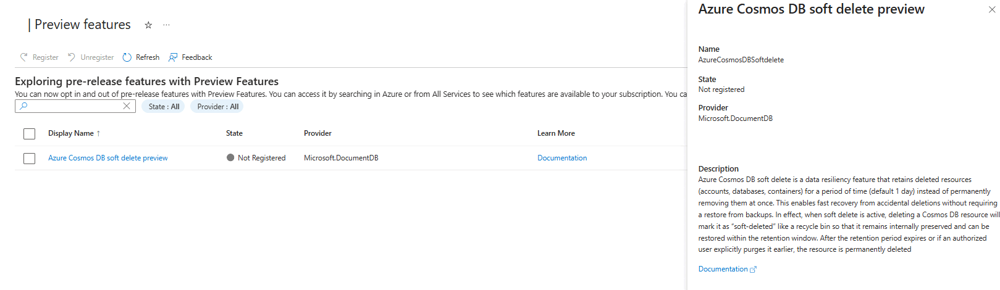

# Soft delete for Azure Cosmos DB (preview)

Azure Cosmos DB soft delete is a data resiliency feature that retains deleted resources (accounts, databases, containers) for a configurable period (default 1 day) instead of permanently removing them at once. Soft delete enables fast recovery from accidental deletions without requiring a restore from backups. In effect, when soft delete is active, deleting an Azure Cosmos DB resource marks it as "soft-deleted" like a recycle bin so that it remains internally preserved and can be restored within the retention window. After the retention period expires or if an authorized user explicitly purges it earlier, the resource is permanently deleted.

This feature addresses a critical operational need: accidental deletion of databases or containers can currently lead to extended downtime and complex restore procedures. Soft delete dramatically reduces downtime by allowing in-place "undo" of deletions in minutes. It provides a safety net so that if an Azure Cosmos DB resource is mistakenly removed, it can be quickly recovered with minimal disruption.

## Key benefits and use cases

- **Rapid recovery and minimal downtime**: Soft delete allows a deleted Azure Cosmos DB resource to be restored within minutes, since the data never truly left the service.
  This approach is a huge improvement over traditional restore workflows that could take many hours. Applications can resume quickly after an accidental deletion, reducing potential downtime from days to minutes.

- **Protection against human error**: It acts as a safety net for mistakes. If an administrator or automation script erroneously deletes a database or container, the data isn't lost – it can be undeleted promptly. Soft delete significantly lowers the risk of catastrophic data loss due to user error and avoids business downtime.

- **Simplified restore process**: Recovery via soft delete is simpler than a backup-based restore. The resource is brought back in-place with the same name, settings, and data it had before deletion. There's no need to create new accounts or containers and no need to reconfigure networking or application connections, since the resource identity remains the same. In-place restore also means all ancillary configuration (indexes, throughput, permissions) remains intact through the soft-delete/recovery cycle.

- **Reduced operational overhead**: The soft delete feature saves engineering time and effort by preventing accidental deletions from turning into major incidents.

- **Complements backup and DR strategies**: Soft delete covers the short-term recovery for accidental deletes, while existing backup and point-in-time restore features cover other scenarios like data corruption or disaster recovery. Together, they provide a more complete data protection story. Notably, if a resource is soft deleted, you would use soft delete recovery rather than backups. In fact, the system doesn't allow restoring a backup over an existing soft-deleted resource – it must be purged first, ensuring the soft delete mechanism is the frontline of defense.

## How soft delete works

### Enabling soft delete

The feature is enabled at the Azure Cosmos DB account level along with the Retention policy. Once soft delete is turned on for an account, all deletions of databases or containers in that account use soft-delete behavior. You can't target specific databases or containers to have different settings – it's an account-wide setting. If soft delete isn't enabled on an account, deletions operate normally, that is, immediate permanent deletion.

When soft delete is enabled, deleting an Azure Cosmos DB account marks the entire account and all child resources as soft-deleted. Deleting a database within a soft-delete-enabled account soft-deletes that database and all containers within it. Deleting a container soft-deletes just that container. This cascading behavior ensures no orphaned resources remain. If you restore a parent resource, such as an account or database, your operation brings back all its children unless you soft-deleted the child resources before soft-deleting the parent.

### Soft-deleted state

Once a resource (account, database, or container) is soft-deleted, it enters a retained but inaccessible state:

- The resource isn't listed among active resources. For example, a soft-deleted container doesn't appear when listing containers in its database.

- All data-plane operations are disabled. Any attempt to access the data behaves as if the resource doesn't exist. Applications receive 404 Not Found errors for queries or updates on a soft-deleted container, identical to the scenario of a permanently deleted one. This behavior ensures the soft-deleted data isn't inadvertently used or modified while pending deletion.

- Internally, however, Azure Cosmos DB retains all the data and metadata for the resource. The deletion is logical – the underlying data files and configurations are preserved during the retention period. The soft-deleted resource is hidden from the user's perspective but still present in the system.

## Retention

**Retention Period**: Soft-deleted resources remain recoverable for a configured retention period. By default, the retention period is 1 day, but administrators can adjust this setting per account from 1 to 30 days. You might choose a shorter retention, such as one day, for lower storage overhead or a longer period, such as 30 days, for extra safety. During this retention window, the resource can be restored at any time. Once the retention period elapses, or if the resource is explicitly purged earlier, the service permanently removes it and it can no longer be restored through soft delete.

- Example: If the retention is set to 14 days and a container is deleted on May 1, it will be kept until May 15. On or shortly after May 15, if not recovered, Azure Cosmos DB will purge that container and its data permanently. Between May 1 and May 15, the container can be recovered with all its content intact, or if an authorized user explicitly purges it earlier, the resource is permanently deleted.

- While a resource is in soft-deleted state, its name is reserved. You can't create a new resource with the same name in that Cosmos account until the original is purged. For instance, if a database named "OrdersDB" was soft-deleted, trying to create a new database called "OrdersDB" results in an error that the name already exists. This restriction prevents any confusion or collision between the soft-deleted resource and new resources.

## Minimum retention before purge

`MinMinutesBeforePermanentDeletionAllowed` - Defines the minimum retention period (in minutes) before a soft-deleted resource can be permanently purged. The minimum allowed is 0 minutes.

- Enforces a safety window—Purge attempts before this time elapses are rejected

- Recovery is always allowed—Resources can be recovered at any time during retention

- Applies to all levels—Containers, databases, and accounts

Example: If set to 60 minutes, a resource deleted at 2:00 PM can't be purged until 3:00 PM

## Recovery (undelete)

At any point during the retention period, an authorized user can undelete or recover the resource. Recovering a soft-deleted resource returns it to the active state:

- The resource reappears in the account with the same URI/name and all its data, provisioned throughput, and settings as it had at the moment it was deleted. It's as if the deletion never happened.

- Any downstream applications can resume using the resource without change.

- Recovery is typically fast because no data copy is needed – it's a metadata operation to flip the resource back to active. From a user's perspective, recovery is instantaneous.

- The retention period and soft-delete status are cleared for that resource (if needed, you could delete it again, which would start a new soft-delete cycle).

To recover a resource, use Azure management tools (once the feature is broadly released).

For example, Azure CLI commands are available for recovery of database or container. The Azure portal also offers a user-friendly interface (for example, a "Recycle Bin" or recover options in Data Explorer) to select a soft-deleted item and recover it. All recover operations are protected by Azure role-based access control (for example, only users assigned the built-in **Cosmos DB Account Contributor** role, also listed as **DocumentDB Account Contributor** in the [Azure built-in roles reference](/azure/role-based-access-control/built-in-roles), or higher-privileged roles can initiate an undelete).

## Permanent deletion (purge)

If you don't recover a soft-deleted resource within the retention period, Azure Cosmos DB automatically purges it after the time elapses. However, you might want to permanently delete a soft-deleted resource before the retention window ends – for example, if you deleted a test resource and don't need it, or for compliance reasons you need it removed immediately. The soft delete feature supports manual purge of a soft-deleted resource:

- An authorized user can issue a Purge command (via CLI, PowerShell, or Portal) to immediately hard-delete the resource even if it's still within the retention period.
- Purging frees up the resource name and stops any further billing for that resource.
- Once purged, the data is unrecoverable except through restoring from backup.

It's worth noting that all delete operations go through the soft delete path when the feature is enabled. There's no way to "bypass" soft delete via a direct hard delete unless you disable the feature entirely on the account or perform a purge after soft deletion. This design ensures consistency: any deletion is reversible by default (within the time window) and only becomes final by explicit choice (waiting out retention or purging).

## Interactions and other details

### Backup restore conflict

If you attempt to restore a backup of a resource that is currently soft-deleted, the service doesn't allow it. You must either restore the soft-deleted resource directly or permanently delete it first. This restriction prevents, for example, restoring an older backup on top of a retained newer copy, which could create inconsistencies. In practice, if a resource is soft-deleted, using soft delete recovery is the preferred approach. Backups come into play if the data is corrupted or if the deletion wasn't noticed until after retention expired.

### Billing and costs

Enabling soft delete doesn't incur any extra service fees – it's a built-in feature. However, while a resource is soft-deleted, it continues to be billed as if it were active. The resource still consumes storage (and potentially the reserved throughput is still allocated). For example, if you soft delete a container that had 10,000 RU/s provisioned, the 10,000 RU/s remain allocated (and charged) until the container is purged. This point is important to understand: soft delete is for protection, not cost savings. Administrators should purge soft-deleted resources when they're confident the data is no longer needed, to avoid unnecessary charges. This feature thus offers safety at the cost of some temporary resource usage overhead.

### Performance

There's no significant performance effect on an account with soft delete enabled, except for the slight overhead when a deletion occurs.
Normal operations on existing data are unaffected. The system's background tasks handle the retention and purge, which are designed to be low-priority and not interfere with foreground workloads.

### Security and access control

Only users with sufficient privileges (for example, Cosmos DB Account Contributor or Owner roles) can soft-delete or restore resources. Soft-deleted data isn't accessible to any read or write operations, so it remains secure in that interim state.

### Management interfaces

Soft delete can be managed through all standard Azure interfaces:

- **Azure portal**: UI to enable/disable the feature at the account level and to enumerate and restore soft-deleted resources (for example, a "Deleted Items" list with the option to recover). This feature isn't available in the gated preview.

- **Azure CLI / PowerShell**: Commands to configure retention, list soft-deleted resources, and invoke restore or purge operations are available (for scripting and automation scenarios).

- **Azure Resource Manager (REST API)**: New properties on the Azure Cosmos DB account resource for soft delete settings (like retention duration) and new APIs to list and restore deleted resources are being introduced.

## Register your subscription

Register your subscription for access to the preview soft delete feature in Azure Cosmos DB. Here are the steps to request access. Registration isn't automatic and can take up to one week to process.

1. Open the **Azure portal** (<https://portal.azure.com>) and sign in with your Azure account.

1. Navigate to the **Preview Features** section of your Azure subscription.

1. Filter the list of preview features using the term "soft delete preview."

1. Locate the **Azure Cosmos DB soft delete preview** feature.

1. Select the **Register** button.

    

## Frequently asked questions

### What is soft delete in Azure Cosmos DB?

Soft delete is a feature that retains deleted Azure Cosmos DB resources (accounts, databases, containers) for a configurable retention period (default 1 day), allowing recovery before permanent deletion.

### How do I enable soft delete?

Soft delete is enabled at the Azure Cosmos DB account level. Once enabled, all deletions within the account follow soft-delete behavior. In preview, the Azure Cosmos DB product team manages enablement.

### Can I recover a deleted container or database?

**Yes**. During the retention period, authorized users can restore soft-deleted resources to their original state. In preview, recovery must be requested through the Azure Cosmos DB team.

### What happens after the retention period ends?

If a soft-deleted resource isn't recovered within the retention period, it's automatically purged and permanently deleted.

### Can I purge a soft-deleted resource before the retention period ends?

**Yes**. Authorized users can manually purge resources. However, if a minimum retention policy is configured, purge might be restricted until that period passes.

### Are soft-deleted resources billed?

**Yes**. Soft-deleted resources continue to incur charges for provisioned throughput and storage until they're purged.

### Can I create a new resource with the same name as a soft-deleted one?

No. Resource names are reserved during the retention period. You must purge the soft-deleted resource before reusing its name.

### Is soft delete available for all compatibility APIs in Azure Cosmos DB?

**No**. Soft delete is supported only for Azure Cosmos DB for NoSQL. MongoDB, Apache Cassandra, Apache Gremlin, and Table aren't supported.

### Is soft delete available in the Azure portal?

**Yes**. Soft delete is available in the Azure portal.

### Can I configure the retention period?

**Yes**. The retention period is configurable per account, from 1 to 30 days. In the current preview, the Azure Cosmos DB team controls this setting.

## Related content

- [Back up and restore introduction](online-backup-and-restore.md)
- [Continuous backup and restore](continuous-backup-restore-introduction.md)
- [Prevent changes or deletion with resource locks](resource-locks.md)
